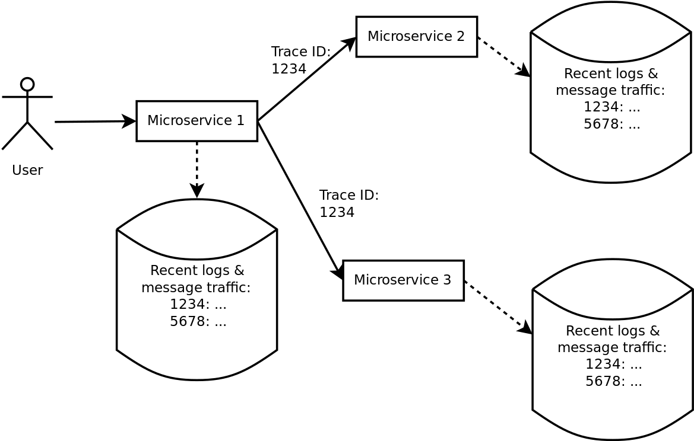
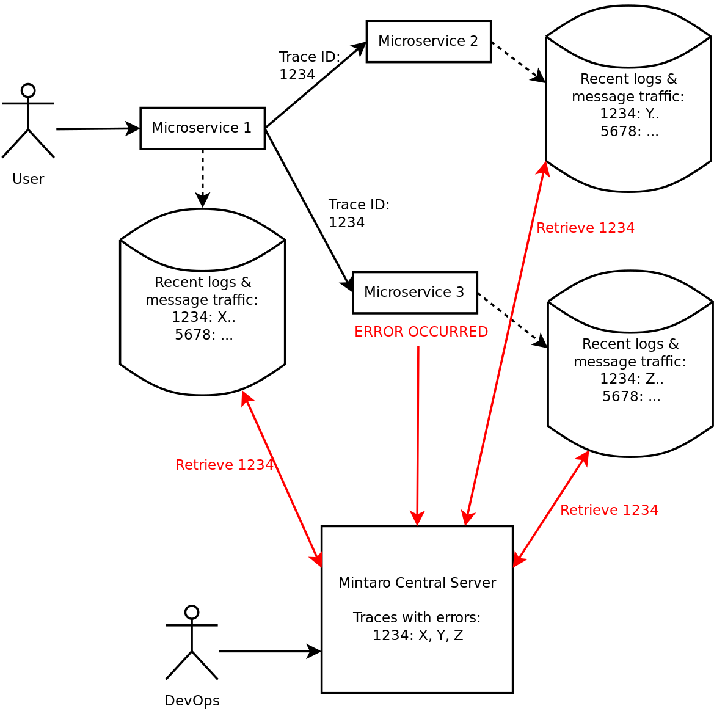

# Mintaro

When you're running a distributed system debugging problems is hard: an error in one service could be caused by problems in completely different services.
In order to debug these problems you want both message transcripts and application logs.
Logging all traffic can be quite expensive, however.

Mintaro solves this problem: it allows you to efficiently capture full debug and traffic logs from your entire service network whenever an error occurs anywhere.

## Mintaro: debugging signal, without the noise

Mintaro shows you all the information you need to debug a problem in your distributed system, both network traffic and logs.
By configuring Mintaro on your servers you can capture all message traffic and logs that relate to a particular error or an abnormally slow request.

Traces of message traffic through the system are used to correlate messages and logs for a particular user request.
Mintaro only sends traces that have errors to the central server... but it sends the messages and logs from all of your servers that participated in the trace, even if the error was occurred elsewhere.

This is why Mintaro is so useful:

* Mintaro shows you *all* the information for a particular error, from an incoming user request to all messaging and logging that led up to the error, across all participating servers.
* Mintaro shows you *only* the information you need to debug a problem, the specific messages and logs for a particular error.
  All signal, no noise.
* Mintaro has much lower performance and bandwidth costs compared to systems that store all traffic.
* Since Mintaro is only sending information on traces with errors, you can configure it to send fine-grained debug logging that you would never be able to send to a normal centralized log store.

### How does it work?

Mintaro provides a client SDK which integrates with common web frameworks like Express.js, Sinatra, Django and Spring.
The SDK stores recent HTTP messaging and logs in a high-performance low overhead local data structure, keeping only recent activity.



Additionally, the Mintaro SDK allows you to use a trace ID to trace traffic as it flows through your system, so that specific requests and logs can be tied to a particular trace.

When an error occurs anywhere in the system, or a distributed trace takes too long, the Mintaro SDK notifies a central server that a specific trace had an error.
The central server then retrieves high fidelity message HTTP request/response traffic and application log messages for that particular trace from the rest of the network of services.

When you log in to the Mintaro control UI you will therefore see full message and log traces only for distributed operations that resulted in errors.



## Setting up Mintaro

Mintaro works by integrating with your web framework and HTTP client.
For example, if you're using Python with `Flask` you would need to add 3 extra lines of code:

```python
import logging
from flask import Flask

# 1. Mintaro import:
from mintaro import flask_setup, MintaroLogHandler

app = Flask(__name__)

# ... your code here ...

if __name__ == '__main__':
    # 2. Integrate Mintaro with Flask:
    flask_setup(app)
    # 3. Integrate Mintaro with logging
    logging.addHandler(MintaroLogHandler())

    # ... your code here:
    app.listen(8080)
```

In addition, when using `requests` to send HTTP requests you would need to register a custom handler to ensure tracing works.
Instead of calling `requests` directly:

```python
import requests

result = requests.get(url)
```

you should instead use Mintaro's API-compatible wrapper:

```python
from mintaro import requests

result = requests.get(url)
```

If you don't want to use this wrapper you can also just manually set the `X-MINTARO-TRACE` HTTP header to the result of calling `mintaro.get_trace_id()`:

```python
import requests
from mintaro import get_trace_id

result = requests.get(url, {"X-MINTARO-TRACE": get_trace_id()})
```

And that's it!

Similar APIs allow you to configure Mintaro on Ruby (as Rack middleware for Sinatra or Rails) or Javascript (as Express.JS middleware), as well as Django, Java frameworks, etc..

### Interested in being a beta tester?

Sign up [here](https://goo.gl/forms/FLf4iL7kzIU5m11P2).
